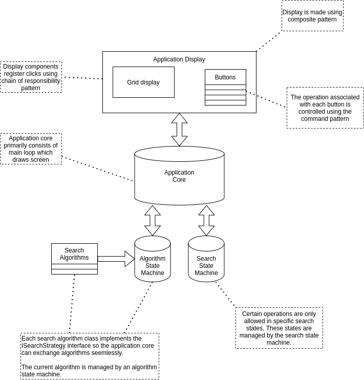
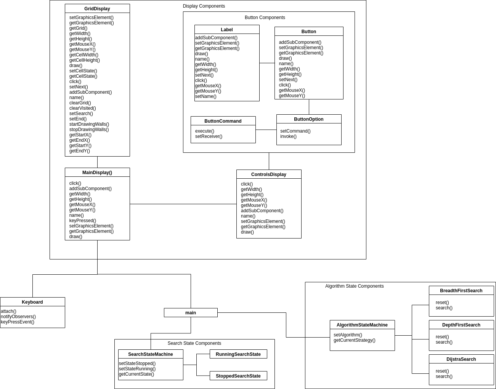

# Odin - Search Algorithms Visualizer

## Topic

- Interactive Application with Processing and Java

## Team Members

- Rounak Salim
- Aidan Jones
- Daniel Yeung
- Hussein Adams

## Areas of Contributions

- Hussein Adams

  - Developed keyboard handler using observer pattern.
  - Developed click handler using chain of responsibility pattern.
  - Developed UI nested views and managed drawing on display using Composite pattern.
  - Developed and owned the UI component (Grid, Control Panel, Buttons, Labels)
  - Fixed numerous feature integration and UI bugs.
  - Created UI wireframe.

- Rounak Salim

  - Developed the search algorithm strategy pattern.
  - Developed the BFS and DFS search algorithms.
  - Kept track of velocity and burn down rate.

- Aidan Jones

  - Developed the state pattern.
  - Developed Dijkstra's search algorithm.
  - Created the overall architecture diagram.

- Daniel Yeung
  - Developed the command pattern to assign functionality to buttons and labels.

## Project Summary

The project goal is to develop a search algorithm visualizer application using the [processing](https://www.processing.org/) framework. It provides several search algorithms BFS, DFS and Dijkstra. By triggering the application, it will search with different paths from the starting cell until reaching the ending cell through traveling the grids. Hence, user can easily understand different algorithms' logic by watching the visualized processing paths.

## Architecture

### High Level Architecture Without Software Interfaces

### Architecture With Software Interfaces

## Features Summary

## Links

- User Story Video: https://youtu.be/d9P7PsuO3aw
- Demo Video:
- Extra Credit Agile Video: None
- Velocity and burn down chart: https://docs.google.com/spreadsheets/d/1AfH8bgbeG_QFUU0F9KdxXLE9ieewj1DtV_e5osFAVTI/edit?usp=sharing

## Setup

- [Processing](https://www.processing.org/) is required to run the project
- Processing-java is also required
  - Open Processing
  - Click on Tools -> install processing-java

## UI Design

UI Wireframe

## Meeting Notes

#### November 14th, 2021

- Project proposal:

  - Search algorithms visualization
  - https://qiao.github.io/PathFinding.js/visual/

- Proposed technologies: Processing, Java

- Suggested algorithms to implement:

  - BFS, DFS, Dijkstra’s (strategy pattern?)
  - Adding new algos should be easy

- Patterns that can be used in the project:

  - Strategy pattern for different search algorithms
  - State pattern to indicate current state of search
  - Possibly observer for displaying the animation
  - Possibly command pattern for menu items to select search

- XP core values
  - Aidan: Communication
  - Hussein: Respect
  - Rounak: Simplicity
  - Daniel: Feedback

#### November 18th, 2021

- Rounak to build a barebone project and push it by eod
- Aidan to look into search algorithms (Dijkstra’s) algorithm
- Hussein to also research how to import custom java classes into .pde files
- Design meeting after we set up a barebone project.

- Processing Path Finder package

  - http://www.robotacid.com/PBeta/AILibrary/Pathfinder/index.html

- Processing GUI options (ControlP5?)
  - https://processing.org/reference/libraries/#gui
